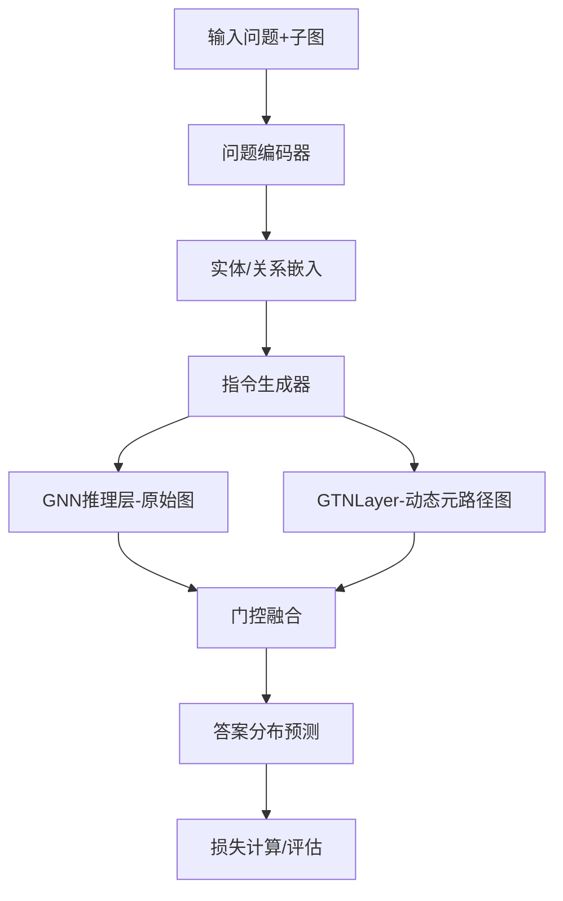

# GNN-RAG 创新与改进详细说明

本项目在原始 GNN-RAG 框架基础上，针对知识图谱问答（KGQA）任务进行了结构性创新，极大提升了模型的推理灵活性和复杂推理能力。以下对主要创新点、原理、实现细节及代码结构进行详细说明。

---

## 一、创新点与原理

### 1. 问题感知的动态元路径生成  
**（Question-Aware Dynamic Metapath Generation）**

#### 背景
- 传统 GTN（Graph Transformer Network）学习到的元路径是静态的，无法针对不同问题动态调整推理路径。
- 实际问答场景下，不同问题需要关注完全不同的关系组合（元路径）。

#### 创新原理与改进细节
- **动态权重生成**：  
  改造 `GTLayer`，使其输入包含问题编码向量（如 W1, W2），这些权重参数可学习，并随问题变化而变化。每个问题的语义信息通过神经网络映射为对不同关系的关注权重。
- **动态指令生成**：  
  每次推理时，根据当前问题的编码，动态生成最优的元路径指令（`relational_ins`），指导 GNN 推理方向。这样模型能针对不同问题，自动选择最优的推理路径，提升对复杂推理需求的适应能力。
- **推理路径自适应**：  
  例如，对于“[演员]->(演过)->(电影)”这样的路径，模型会自动生成与问题最相关的元路径，而不是静态地依赖预定义路径。
- **代码实现**：
  - `gnn/modules/kg_reasoning/gtn_layer.py` 实现了 GTNLayer，forward 方法根据问题向量动态生成关系权重并构建元路径图。
  - 通过 `question_weight_net` 网络将问题向量映射为多通道关系权重，支持多种元路径并行建模。

---

### 2. 混合图推理框架  
**（Hybrid-Graph Reasoning Framework）**

#### 背景
- 单一的 GNN 推理难以同时兼顾多跳推理和复杂关系建模。

#### 创新原理与改进细节
- **双图并行推理**：  
  在每一层 GNN 推理过程中，`ReasonGNNLayer` 和 `GTNLayer` 可同时在两个图上进行信息传递：
  - **原始知识图**：保留所有显式关系，精确建模。
  - **动态元路径图**：由 GTN 模块根据问题动态生成，能学习到跨越多步复杂关系的抽象路径。
- **门控融合机制（Gated Fusion）**：  
  通过门控机制自适应融合两种图的实体表示，提升推理表达力和鲁棒性，避免信息损失，使模型决策更具解释性。
- **多层融合与残差设计**：  
  支持多层GTN和多层GNN的深度融合，并可选用残差连接和节点自适应残差，进一步提升模型表达能力。
- **代码实现**：
  - `gnn/modules/kg_reasoning/gtn_reasoner.py` 实现了 GTNReasonLayer，支持多层GTN和多层GNN的混合推理。
  - `hybrid_fusion` 层实现门控融合，`output_transform` 层实现最终实体表示的变换。
  - `init_reason` 方法初始化两种图结构，`forward`方法在每轮推理时动态融合两种图的推理结果。

---

### 3. 与迭代推理的深度集成  
**（Deep Integration with Iterative Reasoning）**

#### 背景
- 传统 GTN 与 GNN 推理是分离的，难以充分利用问题语义动态调整推理路径。

#### 创新原理与改进细节
- **推理-元路径生成-再推理循环嵌套**：  
  在每一轮 GNN 推理迭代中，模型都会利用最新的推理指令，重新调用问题感知的 GTN 模块，生成当前最优的元路径图。推理路径会随着推理过程不断被优化和调整，提升了模型的动态推理能力。
- **自适应推理深度与路径**：  
  每一轮推理都可根据当前实体分布和问题语义，动态调整推理深度和路径，提升复杂推理任务的表现。
- **代码实现**：
  - 在 `ReaRev` 等模型的 `init_reason` 和 `forward` 方法中，每轮推理都动态生成元路径并融合推理结果。
  - `GTNReasonLayer` 支持在每轮推理中根据最新指令和实体分布动态调整推理路径。

---

## 二、代码结构与实现说明

### 1. 主要新增与改造模块

#### （1）GTNLayer（问题感知的元路径生成层）
- 路径：`gnn/modules/kg_reasoning/gtn_layer.py`
- 功能：根据问题编码动态生成元路径图，实现问题感知的关系权重分配和消息传递。
- 关键点：
  - `question_weight_net`：根据问题向量生成每种关系的权重。
  - `forward`方法：对每个batch、每个通道动态生成元路径邻接矩阵，并进行消息传递。
  - `fusion_with_original`：与原始图的实体表示进行门控融合。

#### （2）GTNReasonLayer（混合图推理层）
- 路径：`gnn/modules/kg_reasoning/gtn_reasoner.py`
- 功能：在原始知识图和动态元路径图上并行推理，并通过门控机制融合两种图的实体表示。
- 关键点：
  - `gtn_modules`：支持多层、多通道的GTN推理。
  - `hybrid_fusion`：门控融合层，融合两种图的实体表示。
  - `init_reason`：初始化本轮推理所需的图结构和实体嵌入。
  - `forward`：每轮推理时动态调用GTNLayer，融合推理结果。

#### （3）ReaRev模型的集成与切换
- 路径：`gnn/models/ReaRev/rearev.py`
- 关键点：
  - `private_module_def`方法：根据参数`use_gtn`决定使用`GTNReasonLayer`（创新）还是`ReasonGNNLayer`（原始）。
  - `init_reason`和`forward`：每轮推理时动态生成元路径并进行融合推理。

### 2. 主要参数与配置
- `use_gtn`：是否启用GTN动态元路径推理。
- `gtn_channels`、`gtn_layers`：控制GTN的通道数和层数。
- `num_gnn`、`num_ins`：控制GNN推理的层数和指令数。
- 通过`parsing.py`和命令行参数灵活配置。

### 3. 推理流程示意

### 4. 代码结构对比表

| 组件/功能         | 原始GNN-RAG（origin）         | 创新版GNN-RAG（当前）                |
|------------------|------------------------------|--------------------------------------|
| GNN推理层        | ReasonGNNLayer等静态推理      | 新增GTNLayer/GTNReasonLayer，支持动态元路径与混合推理 |
| 元路径生成       | 无                           | 问题感知的动态元路径生成（GTN）      |
| 图结构           | 单一知识图谱                 | 原始图+动态元路径图混合              |
| 融合机制         | 无                           | 门控融合机制                         |
| 推理流程         | 静态多跳                     | 推理-元路径生成-再推理深度集成       |
| 参数灵活性       | 固定                         | 支持use_gtn等参数灵活切换            |

---

## 三、总结

本创新版 GNN-RAG 通过引入**问题感知的动态元路径生成**、**混合图推理框架**和**与迭代推理的深度集成**，极大提升了模型对复杂知识图谱问答任务的适应能力和推理效率。  
这些创新点不仅丰富了模型的表达能力，也为后续的学术研究和实际应用提供了坚实的基础。

如需更详细的模块代码说明或具体实现细节，可进一步补充！ 